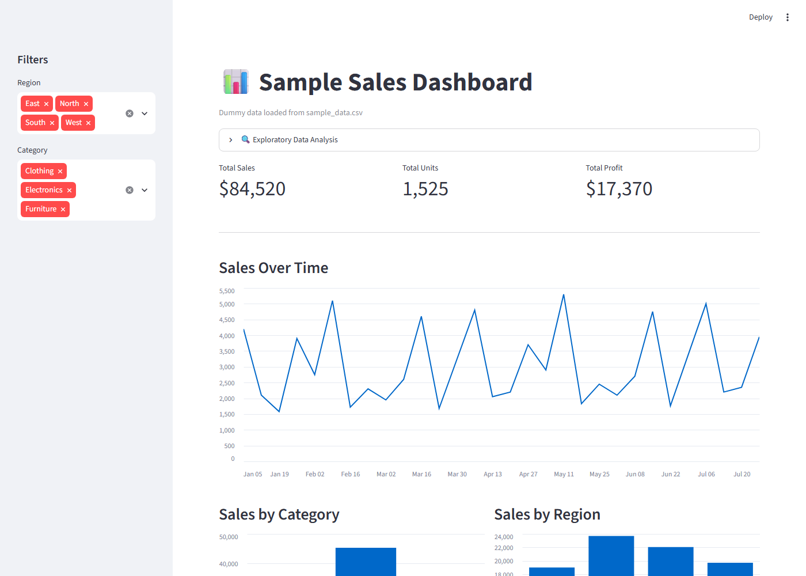
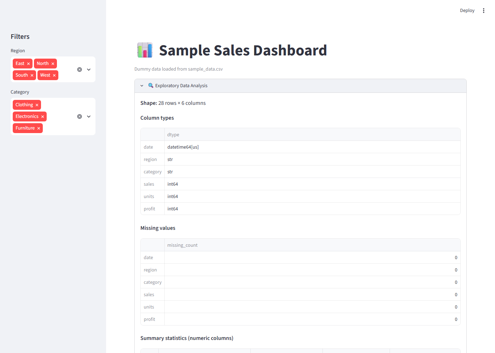

# Sample Sales Dashboard

A small Streamlit app that loads a dummy sales CSV, runs a quick exploratory
data analysis (EDA), and visualizes the data with interactive charts.

## Features

- KPI metrics (total sales, units, profit)
- Collapsible EDA section: shape, dtypes, missing values, summary statistics,
  correlation matrix, and a sales distribution chart
- Sidebar filters by region and category
- Sales-over-time line chart
- Sales-by-category and sales-by-region bar charts
- Profit-vs-units scatter chart colored by category
- Raw data table

## Data

[`sample_data.csv`](sample_data.csv) is dummy data with columns:
`date, region, category, sales, units, profit`.

## Setup

This project uses [uv](https://docs.astral.sh/uv/) for dependency management.

```bash
uv sync
```

## Run

```bash
uv run streamlit run app.py
```

Then open [http://localhost:8501](http://localhost:8501) in your browser.

## Screenshots

**Dashboard overview**



**Exploratory data analysis**


